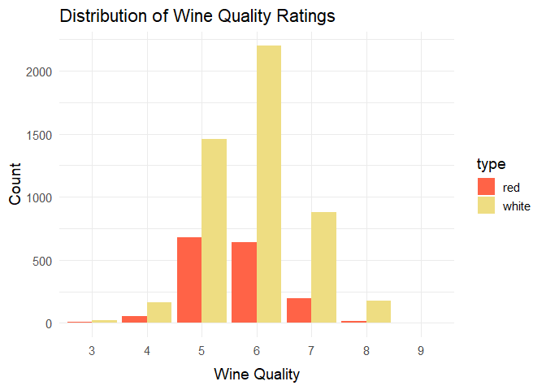
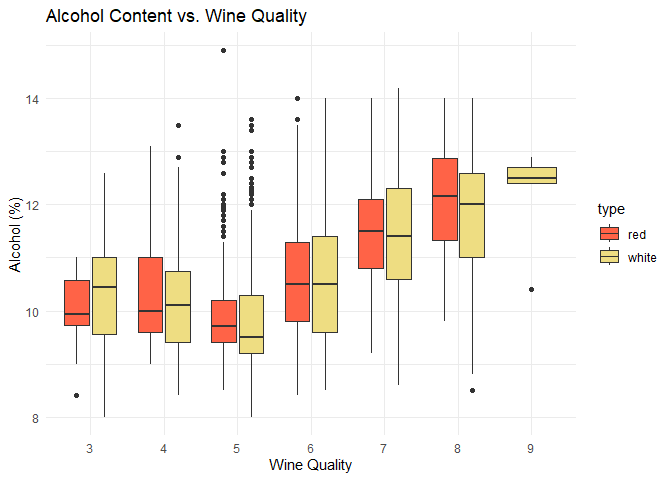
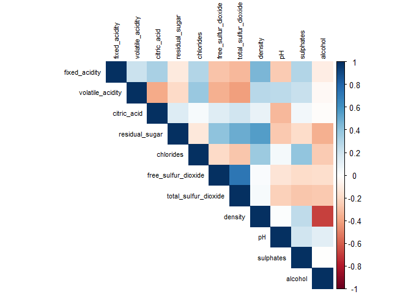

README
================

# Business Understanding

The primary goal of this project is to understand the factors that influence wine quality. Wine quality is typically rated by experts on a scale (e.g., from 0 to 10), and it is influenced by a range of physicochemical properties such as acidity, sugar content, alcohol percentage, and more.

*Research Question:* What physicochemical characteristics are most strongly associated with higher wine quality?

*Findings (based on prior research and dataset characteristics):*

1.  Alcohol content is often one of the strongest predictors of wine quality — higher alcohol levels are typically associated with better taste and quality.

2.  Volatile acidity (which refers to the amount of acetic acid in wine) tends to negatively affect wine quality; higher volatile acidity usually means a lower quality score.

3.  Sulphates and citric acid contents tend to have a positive impact, as they are linked to better preservation and flavor enhancement.

4.  Residual sugar and density are less consistently related to quality; excessive sugar or high density could suggest lower quality.

5.  pH levels have a minor influence, but extreme pH values might indicate problems with the wine’s balance.

6.  Fixed acidity and total acidity contribute to the freshness and stability of wine but are usually secondary factors.

This information was taken from the paper titled ‘Modeling Wine Preferences by Data Mining from Physicochemical Properties’ by Cortez, P., Cerdeira, A., Almeida, F., Matos, T., & Reis, J. and it was published in the Decision Support Systems in 2009.

# Business Implication:

Understanding these factors is essential for winemakers aiming to improve product quality, for marketers who want to better classify wines, and for consumers who seek to choose high-quality wines based on measurable features. A reliable model that predicts wine quality could also help producers adjust their processes or optimize harvest and fermentation decisions.

# Data Understanding

The first step is to organize the 2 csv files we have (one for red wine and one for white wine) properly. Then we combine the two files into one so it makes it easier for us to perform analyses. The code chunks below do that for us.

``` r
library(readr)

# Read with correct delimiter
data <- read_delim("winequality-red.csv", delim = ";")  # Change delim if needed
```

    ## Rows: 1599 Columns: 12
    ## ── Column specification ────────────────────────────────────────────────────────
    ## Delimiter: ";"
    ## dbl (12): fixed acidity, volatile acidity, citric acid, residual sugar, chlo...
    ## 
    ## ℹ Use `spec()` to retrieve the full column specification for this data.
    ## ℹ Specify the column types or set `show_col_types = FALSE` to quiet this message.

``` r
# View the first few rows
head(data)
```

    ## # A tibble: 6 × 12
    ##   `fixed acidity` `volatile acidity` `citric acid` `residual sugar` chlorides
    ##             <dbl>              <dbl>         <dbl>            <dbl>     <dbl>
    ## 1             7.4               0.7           0                 1.9     0.076
    ## 2             7.8               0.88          0                 2.6     0.098
    ## 3             7.8               0.76          0.04              2.3     0.092
    ## 4            11.2               0.28          0.56              1.9     0.075
    ## 5             7.4               0.7           0                 1.9     0.076
    ## 6             7.4               0.66          0                 1.8     0.075
    ## # ℹ 7 more variables: `free sulfur dioxide` <dbl>,
    ## #   `total sulfur dioxide` <dbl>, density <dbl>, pH <dbl>, sulphates <dbl>,
    ## #   alcohol <dbl>, quality <dbl>

``` r
library(readr)

# Read with correct delimiter
data1 <- read_delim("winequality-white.csv", delim = ";")  # Change delim if needed
```

    ## Rows: 4898 Columns: 12
    ## ── Column specification ────────────────────────────────────────────────────────
    ## Delimiter: ";"
    ## dbl (12): fixed acidity, volatile acidity, citric acid, residual sugar, chlo...
    ## 
    ## ℹ Use `spec()` to retrieve the full column specification for this data.
    ## ℹ Specify the column types or set `show_col_types = FALSE` to quiet this message.

``` r
# View the first few rows
head(data1)
```

    ## # A tibble: 6 × 12
    ##   `fixed acidity` `volatile acidity` `citric acid` `residual sugar` chlorides
    ##             <dbl>              <dbl>         <dbl>            <dbl>     <dbl>
    ## 1             7                 0.27          0.36             20.7     0.045
    ## 2             6.3               0.3           0.34              1.6     0.049
    ## 3             8.1               0.28          0.4               6.9     0.05 
    ## 4             7.2               0.23          0.32              8.5     0.058
    ## 5             7.2               0.23          0.32              8.5     0.058
    ## 6             8.1               0.28          0.4               6.9     0.05 
    ## # ℹ 7 more variables: `free sulfur dioxide` <dbl>,
    ## #   `total sulfur dioxide` <dbl>, density <dbl>, pH <dbl>, sulphates <dbl>,
    ## #   alcohol <dbl>, quality <dbl>

Combine both datasets

``` r
# Add a new column to identify wine type
data$type <- "red"
data1$type <- "white"

wine <- rbind(data, data1)

head(wine)
```

    ## # A tibble: 6 × 13
    ##   `fixed acidity` `volatile acidity` `citric acid` `residual sugar` chlorides
    ##             <dbl>              <dbl>         <dbl>            <dbl>     <dbl>
    ## 1             7.4               0.7           0                 1.9     0.076
    ## 2             7.8               0.88          0                 2.6     0.098
    ## 3             7.8               0.76          0.04              2.3     0.092
    ## 4            11.2               0.28          0.56              1.9     0.075
    ## 5             7.4               0.7           0                 1.9     0.076
    ## 6             7.4               0.66          0                 1.8     0.075
    ## # ℹ 8 more variables: `free sulfur dioxide` <dbl>,
    ## #   `total sulfur dioxide` <dbl>, density <dbl>, pH <dbl>, sulphates <dbl>,
    ## #   alcohol <dbl>, quality <dbl>, type <chr>

## Dataset Information

``` r
#Number of samples
nrow(wine)
```

    ## [1] 6497

``` r
#Number of features
ncol(wine) - 1 #excluding type column
```

    ## [1] 12

## Feature Descriptions

| Feature              | Description                     | Data Type |
|:---------------------|:--------------------------------|:----------|
| fixed acidity        | Tartaric acid content           | Ratio     |
| volatile acidity     | Acetic acid content             | Ratio     |
| citric acid          | Citric acid content             | Ratio     |
| residual sugar       | Sugar after fermentation        | Ratio     |
| chlorides            | Salt content                    | Ratio     |
| free sulfur dioxide  | SO2 preventing microbial growth | Ratio     |
| total sulfur dioxide | Sum of free and bound SO2       | Ratio     |
| density              | Wine density                    | Ratio     |
| pH                   | Acidity level                   | Interval  |
| sulphates            | Sulfate salts                   | Ratio     |
| alcohol              | Alcohol percentage              | Ratio     |
| quality              | Quality score (0-10)            | Ordinal   |
| type                 | Wine type (red or white)        | Nominal   |

# Data Preparation

The csv files were loaded as shown in the code chunks above Then we check for missing values because if there are any missing values, we need to drop them as they may affect out analyses. We also have to change some of our column names and replace the whitespaces with ’\_’ as we will be unable to use those columns for graphing and analyses.

We do that by using this code below

``` r
# Check for missing values
colSums(is.na(wine))
```

    ##        fixed acidity     volatile acidity          citric acid 
    ##                    0                    0                    0 
    ##       residual sugar            chlorides  free sulfur dioxide 
    ##                    0                    0                    0 
    ## total sulfur dioxide              density                   pH 
    ##                    0                    0                    0 
    ##            sulphates              alcohol              quality 
    ##                    0                    0                    0 
    ##                 type 
    ##                    0

``` r
#Changing column names
colnames(wine)[1] <- "fixed_acidity"
colnames(wine)[2] <- "volatile_acidity"
colnames(wine)[3] <- "citric_acid"
colnames(wine)[4] <- "residual_sugar"
colnames(wine)[6] <- "free_sulfur_dioxide"
colnames(wine)[7] <- "total_sulfur_dioxide"


head(wine)
```

    ## # A tibble: 6 × 13
    ##   fixed_acidity volatile_acidity citric_acid residual_sugar chlorides
    ##           <dbl>            <dbl>       <dbl>          <dbl>     <dbl>
    ## 1           7.4             0.7         0               1.9     0.076
    ## 2           7.8             0.88        0               2.6     0.098
    ## 3           7.8             0.76        0.04            2.3     0.092
    ## 4          11.2             0.28        0.56            1.9     0.075
    ## 5           7.4             0.7         0               1.9     0.076
    ## 6           7.4             0.66        0               1.8     0.075
    ## # ℹ 8 more variables: free_sulfur_dioxide <dbl>, total_sulfur_dioxide <dbl>,
    ## #   density <dbl>, pH <dbl>, sulphates <dbl>, alcohol <dbl>, quality <dbl>,
    ## #   type <chr>

Since there are no missing values, we do not need to make any changes to our data

Next we generate some summary statistics to get a better idea of our data using this code below

``` r
# Summary statistics
summary(wine)
```

    ##  fixed_acidity    volatile_acidity  citric_acid     residual_sugar  
    ##  Min.   : 3.800   Min.   :0.0800   Min.   :0.0000   Min.   : 0.600  
    ##  1st Qu.: 6.400   1st Qu.:0.2300   1st Qu.:0.2500   1st Qu.: 1.800  
    ##  Median : 7.000   Median :0.2900   Median :0.3100   Median : 3.000  
    ##  Mean   : 7.215   Mean   :0.3397   Mean   :0.3186   Mean   : 5.443  
    ##  3rd Qu.: 7.700   3rd Qu.:0.4000   3rd Qu.:0.3900   3rd Qu.: 8.100  
    ##  Max.   :15.900   Max.   :1.5800   Max.   :1.6600   Max.   :65.800  
    ##    chlorides       free_sulfur_dioxide total_sulfur_dioxide    density      
    ##  Min.   :0.00900   Min.   :  1.00      Min.   :  6.0        Min.   :0.9871  
    ##  1st Qu.:0.03800   1st Qu.: 17.00      1st Qu.: 77.0        1st Qu.:0.9923  
    ##  Median :0.04700   Median : 29.00      Median :118.0        Median :0.9949  
    ##  Mean   :0.05603   Mean   : 30.53      Mean   :115.7        Mean   :0.9947  
    ##  3rd Qu.:0.06500   3rd Qu.: 41.00      3rd Qu.:156.0        3rd Qu.:0.9970  
    ##  Max.   :0.61100   Max.   :289.00      Max.   :440.0        Max.   :1.0390  
    ##        pH          sulphates         alcohol         quality     
    ##  Min.   :2.720   Min.   :0.2200   Min.   : 8.00   Min.   :3.000  
    ##  1st Qu.:3.110   1st Qu.:0.4300   1st Qu.: 9.50   1st Qu.:5.000  
    ##  Median :3.210   Median :0.5100   Median :10.30   Median :6.000  
    ##  Mean   :3.219   Mean   :0.5313   Mean   :10.49   Mean   :5.818  
    ##  3rd Qu.:3.320   3rd Qu.:0.6000   3rd Qu.:11.30   3rd Qu.:6.000  
    ##  Max.   :4.010   Max.   :2.0000   Max.   :14.90   Max.   :9.000  
    ##      type          
    ##  Length:6497       
    ##  Class :character  
    ##  Mode  :character  
    ##                    
    ##                    
    ## 

# Modeling and Evaluating

## Exploratory Data Analysis (EDA)

### Wine Quality Distribution

``` r
library(ggplot2)
ggplot(wine, aes(x = quality, fill = type)) +
  geom_bar(position = "dodge") +
  theme_minimal() +
  labs(title = "Wine Quality Distribution by Type", x = "Quality", y = "Count")
```

<!-- -->

**Observation:** White wines dominate higher quality ratings, while red wines are more concentrated in mid-range ratings.

### Feature Distributions

``` r
library(ggplot2)
library(dplyr)
```

    ## 
    ## Attaching package: 'dplyr'

    ## The following objects are masked from 'package:stats':
    ## 
    ##     filter, lag

    ## The following objects are masked from 'package:base':
    ## 
    ##     intersect, setdiff, setequal, union

``` r
# Alcohol vs. Quality
wine %>%
  ggplot(aes(x = quality, y = alcohol, fill = type)) +
  geom_boxplot() +
  theme_minimal() +
  labs(title = "Alcohol Content vs. Wine Quality", x = "Quality", y = "Alcohol")
```

<!-- -->

**Question:** Does higher alcohol content relate to better quality?

### Simple Visualization: Density Plots

``` r
ggplot(wine, aes(x = alcohol, fill = type)) +
  geom_density(alpha = 0.5) +
  theme_minimal() +
  labs(title = "Density Plot of Alcohol Content", x = "Alcohol", y = "Density")
```

<!-- -->

``` r
wine %>%
  ggplot(aes(x = volatile_acidity, fill = type)) +
  geom_density(alpha = 0.5) +
  theme_minimal() +
  labs(title = "Density Plot of Volatile Acidity", x = "Volatile Acidity", y = "Density")
```

<!-- -->

### Correlation Heatmap

``` r
library(corrplot)
```

    ## corrplot 0.95 loaded

``` r
corr_matrix <- cor(wine %>% select(-type))

corrplot(corr_matrix, method = "color", type = "upper", tl.cex = 0.7, tl.col = "black")
```

<!-- -->

**Observation:** Alcohol is positively correlated with quality, while volatile acidity and density are negatively correlated.

## Hypothesis Testing

### Hypothesis 1

- **H0:** Alcohol content does not differ across quality scores.
- **HA:** Alcohol content differs across quality scores.

**Test:** ANOVA

**Assumptions:** - Independence: Data collected independently. - Normality: Each group’s alcohol is roughly normally distributed. - Homogeneity of variance: Variance of alcohol content similar across groups.

``` r
library(car)
```

    ## Loading required package: carData

    ## 
    ## Attaching package: 'car'

    ## The following object is masked from 'package:dplyr':
    ## 
    ##     recode

``` r
# Check normality
wine %>%
  group_by(quality) %>%
  summarise(shapiro_p = shapiro.test(alcohol)$p.value)
```

    ## # A tibble: 7 × 2
    ##   quality shapiro_p
    ##     <dbl>     <dbl>
    ## 1       3  8.99e- 1
    ## 2       4  1.15e- 5
    ## 3       5  1.68e-33
    ## 4       6  4.52e-24
    ## 5       7  2.47e-10
    ## 6       8  1.28e- 8
    ## 7       9  2.01e- 2

``` r
# Check homogeneity of variances
leveneTest(alcohol ~ as.factor(quality), data = wine)
```

    ## Levene's Test for Homogeneity of Variance (center = median)
    ##         Df F value    Pr(>F)    
    ## group    6  66.339 < 2.2e-16 ***
    ##       6490                      
    ## ---
    ## Signif. codes:  0 '***' 0.001 '**' 0.01 '*' 0.05 '.' 0.1 ' ' 1

``` r
# Perform Kruskal-Wallis Test 
kruskal_result <- kruskal.test(alcohol ~ as.factor(quality), data = wine)
kruskal_result
```

    ## 
    ##  Kruskal-Wallis rank sum test
    ## 
    ## data:  alcohol by as.factor(quality)
    ## Kruskal-Wallis chi-squared = 1397.3, df = 6, p-value < 2.2e-16

Shapiro - Wilk test - tests whther the data is normally distributed. Since our p\<0.05 and we have ordinal data type, we need to perform some non-parametric tests like Spearman Rank’s correlation and Kruskal-Wallis test to compare median across multiple groups. Since our p-value \< 0.05, we can reject our null hypothesis. Therefore we have enough evidence to support the hypothesis that alcohol content differs across quality scores.

### Hypothesis 2

- **H0:** Volatile acidity is independent of wine quality.
- **HA:** Volatile acidity negatively affects wine quality.

**Test:** Correlation Test

``` r
cor.test(wine$volatile_acidity, wine$quality, method = "spearman")
```

    ## Warning in cor.test.default(wine$volatile_acidity, wine$quality, method =
    ## "spearman"): Cannot compute exact p-value with ties

    ## 
    ##  Spearman's rank correlation rho
    ## 
    ## data:  wine$volatile_acidity and wine$quality
    ## S = 5.7491e+10, p-value < 2.2e-16
    ## alternative hypothesis: true rho is not equal to 0
    ## sample estimates:
    ##        rho 
    ## -0.2578059

Since our p-vale \< 0.05, we can reject our null hypothesis. Therefore, we have enough evidence to support our hypothesis that volatile acidity negatively affects wine quality.

# Final Business Insights

- **Alcohol content** has a statistically significant positive relationship with wine quality.
- **Volatile acidity** has a statistically significant negative relationship with wine quality.
- **Sulphates** and **citric acid** also show positive but smaller associations.
- EDA indicates that white wines slightly outperform red wines in quality ratings on average.

**Recommendations:** - Focus on optimizing alcohol levels to improve perceived wine quality. - Reduce volatile acidity during fermentation to avoid lower quality ratings. - Minor adjustments in sulphates and citric acid could yield better-tasting wines.
